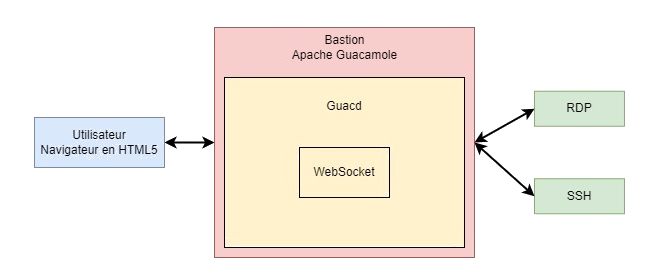

# Guacamole Apache

Guacamole is used to create a bastion. First we login on web interface, and we can connect to computer set in RDP.

In this section, we found some scripts to simplify some admin action on guacamole.

## Script lists

- Install guacamole instance
- Upgrade guacamole instance
