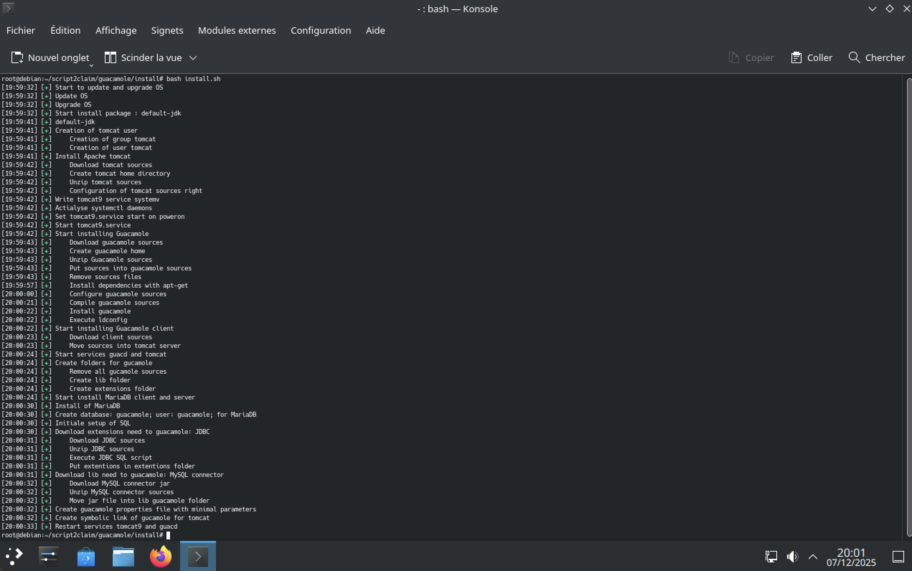
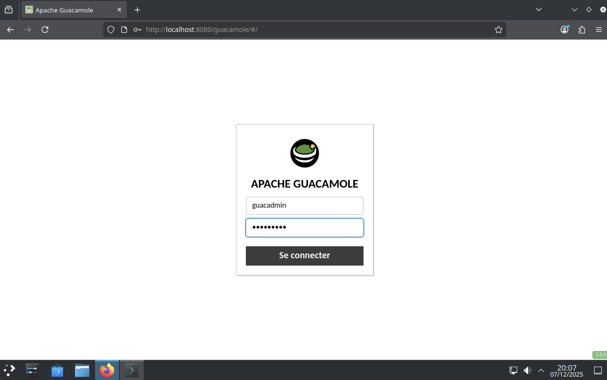
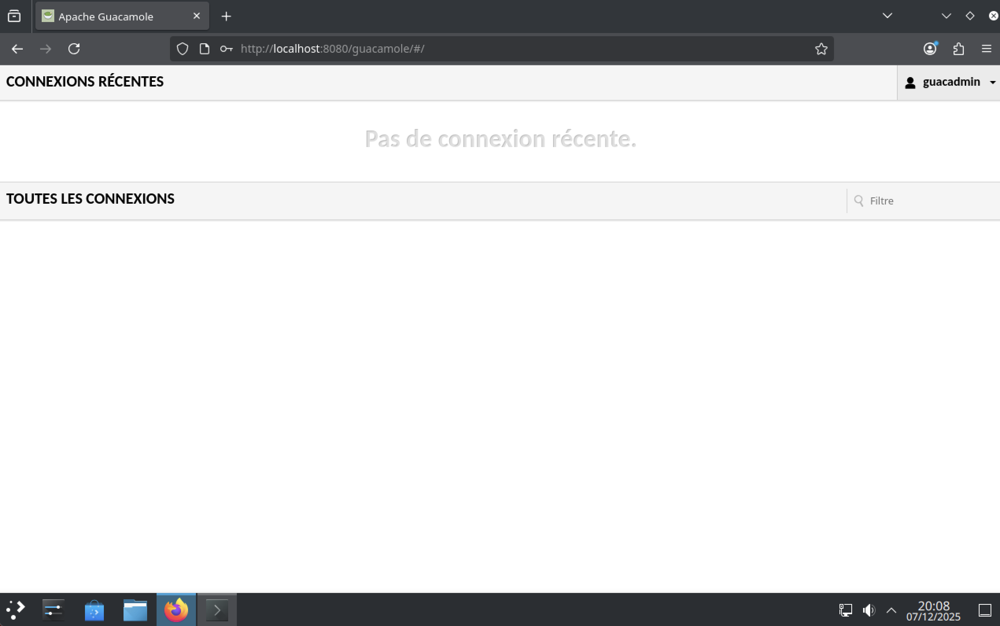

# Install guacamole

In this section, we show a procedure to install an instance of `guacamole` installed in `Debian OS` (All installations are made in VM on MacOS ARM).

The version of guacamole installed by this script is 1.5.5 (actually the last version is 1.6.0, but the choice of an old version to create an upgrade script).

> That's important to know, Guacamole needs tomcat9 and not tomcat10

> Debian 13 can't install guacamole now. During this install, I use Debian 12 instance

## Execute script

To install guacamole with this script, execute these commands in `root` user.

```bash
git clone https://github.com/yanistvg/script2claim.git
cd script2claim/guacamole/install/
bash install.sh
```



Now installation made, we are going on `http://localhost:8080/guacamole` to log in to guacamole.



For first login, the default user is `guacadmin` and the password is the same.



## Warning

This installation is default to use Guacamole, but some changes do be processed, like for tomcat logs, it's recommanded to put them in `/var/log/tomcat9` (to process, set a symbolic link).

During writing this code, this Guacamole version install is the penultimate, only because I would create the script to upgrade guacamole, so it's required to upgrade this version of guacamole by the latest.
